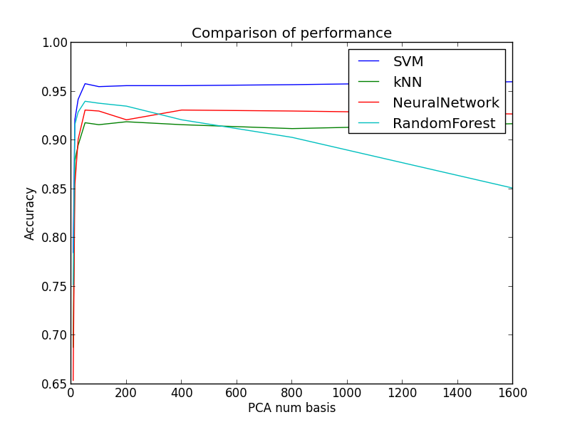

# Classifying Single-Cell Types from Mouse Brain RNA-Seq Data using Machine Learning Algorithms

-----

## Team mebers

- Samer Al-Saffar
- Hankyu Jang

## Datasets

- line 2: group (label)
- line 12 ~ line 5009: data (gene expression level)
- data: column 3 ~ : activation levels

### Prerequisite

Since the codes are written in Python 3, if you run the code on the campus servers, turn Python 3 module on by running:

```
module load python/3.6.0
```

The dataset is too large to push it into the Github. Please download the dataset [here](https://drive.google.com/open?id=0B44YNR0bSKpQQ1kwR0pOZEZFM2M), then make a directory data/ and save the expressionmRNAAnnotations.txt in the directory.

### Preprocessing

`data_cleaning.py`

- Input
    - expressionmRNAAnnotations.txt
    - kfold (integer)
- Procedure
    - Cleans the data, then creates data matrix X and corresponding label vector y
    - Prepares k sets of trainset and testset using cross-validation
    - Saves the datasets as npz file format

```
python src/data_cleaning.py -i data/expressionmRNAAnnotations.txt -o data/dataset -kfold 5
```

-----

## Experiment1 (Using original data)

### Source Codes

- `main_knn.py`
- `main_rf.py`
- `main_svm.py`
- `main_nn.py`
- `classification_algo.py`: Holds the classifications algorithms used in the experiment.

### Classifier 

I tried various sets of parameters for different classifiers. Results are saved here:

- knn.dat
- rf.dat
- svm.dat
- nn.dat

### Testing

- Parameter tuning for K nearest neighbor

    - number of neighbors: (3, 5, 7, ... , 19)
    - weights tuple: ("uniform", "distance")

```
python src/main_knn.py -i data/dataset.npz
```

- Parameter tuning for Random Forest

    - criterion tuple: ("gini", "entropy")
    - number of trees: 4, 8, 16, ... , 4096
    - minimum number of samples required to split an internal node: 2, 4, 8, ... , 32

```
python src/main_rf.py -i data/dataset.npz
```

- Parameter tuning for SVM

    - kernel: 'linear', 'poly', 'rbf', 'sigmoid'
    - penalty parameter C of the error term: 2^(-3), 2^(-1), ..., 2^(15)
    - gamma (Kernel coefficient for 'rbf', 'poly' and 'sigmoid'): 2^(-15), 2^(-13), ..., 2^(3)
    - degree of the polynomial kernel function: 1, 2, ... , 4

```
python src/main_svm.py -i data/dataset.npz -kernel linear
python src/main_svm.py -i data/dataset.npz -kernel poly
python src/main_svm.py -i data/dataset.npz -kernel rbf
python src/main_svm.py -i data/dataset.npz -kernel sigmoid
```

- Parameter tuning for Neural Network

    - hidden layers: 27 different hidden layers (16, 16, 16) to (64, 64, 64)
    - activation function for the hidden layer: 
        - identity: f(x) = x
        - logistic: f(x) = 1 / (1 + exp(-x))
        - tanh: f(x) = tanh(x)
        - relu: f(x) = max(0, x)
    - solver for weight optimization:
        - 'adam' refers to a stochastic gradient-based optimizer proposed by Kingma, Diederik, and Ji    mmy
        - note: The default solver 'adam' works pretty well on relatively large datasets (with thousands of training samples or more) in terms of both training time and validation score. For small datasets, however, 'lbfgs' can converge faster and perform better. 
    - alpha(L2 penalty (regularization term) parameter): 2^(-8), 2^(-7), ... , 1

```
python src/main_nn.py -i data/dataset.npz -activation identity -solver adam
python src/main_nn.py -i data/dataset.npz -activation logistic -solver adam
python src/main_nn.py -i data/dataset.npz -activation tanh -solver adam
python src/main_nn.py -i data/dataset.npz -activation relu -solver adam
```

### Result

Best parameter sets found for each classifier: Accuracy changes slightly for each experiment, since the training and testsets are randomly divided into 5 different groups.

- knn: around 91% accuracy
    - n=3,weights=uniform,kNN
- rf: around 95% accuracy 
    - 0.958,criterion=gini,n=128,minss=4,RandomForest
- svm: around 96.5% accuracy 
    - 0.961,kernel=poly,C=0.125,gamma=0.001953125,degree=1,SVM
- nn: around 96% accuracy 
    - 0.960,hls=(32, 32, 64),alpha=0.00390625,activation=identity,solver=adam,NeuralNetwork

I used 5-fold cross-validation for the experiment. Following boxplot is drawn from the above parameter sets.

```
./src/draw_boxplot.sh
```


-----

## Experiment2

The dataset used in Experiment1 has shape (3005, 4998). Compared to the samples, there seems to be too many features. Hence, in Experiment2, I implemented feature reduction algorithm PCA to reduce the dimension of the data.

### Source Codes

- `main_knn2.py`
- `main_rf2.py`
- `main_svm2.py`
- `main_nn2.py`

### Preprocessing

`data_cleaning_pca.py`

- Input
    - expressionmRNAAnnotations.txt
    - kfold (integer)
    - n (integer) for number of basis vectors to use
- Procedure
    - Cleans the data, then creates data matrix X and corresponding label vector y
    - Reduces the dimension of the dataset by applying PCA.
    - Prepares k sets of trainset and testset using cross-validation
    - Saves the datasets as npz file format

Example code for creating datasets by selecting top 100 basis vectors

```
python src/data_cleaning_pca.py -i data/expressionmRNAAnnotations.txt -o data/dataset_pca100 -kfold 5 -n 100
```

### Classifier 

I tried the good working parameters sets found in Experiment1 for each classifier. I changed each main function of the classifcation algorithm so that all the needed parameteres can be put in as parameters from terminal. For each algorithm, I used two different sets of good working parameters. I tried selecting different number of basis vectors using pca: 7, 13, 25, 50, 100, 200, 400, 500, 800, 1600.

Results are saved here:

- pca7.dat
- pca13.dat
- pca25.dat
- pca50.dat
- pca100.dat
- pca200.dat
- pca400.dat
- pca500.dat
- pca800.dat
- pca1600.dat

### Testing

Use the good parameter sets found above and feed them as parameter sets for each classification algorithms.

Example code using 100 basis vectors dataset

```
python src/main_svm2.py -i data/dataset_pca100.npz -C 0.125 -kernel poly -gamma 0.001953125 -degree 1 > result/pca100.dat
python src/main_knn2.py -i data/dataset_pca100.npz -n 3 -weights uniform >> result/pca100.dat
python src/main_nn2.py -i data/dataset_pca100.npz -hls 32 32 64 -activation identity -solver adam -alpha 0.00390625 >> result/pca100.dat
python src/main_rf2.py -i data/dataset_pca100.npz -criterion gini -n 128 -minss 4 >> result/pca100.dat
```

Following bash script tests classification with different number of basis vectors.

```
./src/experiment2.sh
```

### Result

Output using 100 basis vectors dataset (for one particular experiment)

- knn:
    - 0.917,n=3,weights=uniform,kNN
- svm:
    - 0.957,kernel=poly,C=0.125,gamma=0.001953125,degree=1,SVM
- nn:
    - 0.926,hls=(32, 32, 64),alpha=0.00390625,activation=identity,solver=adam,NeuralNetwork
- rf:
    - 0.938,criterion=gini,n=128,minss=4,RandomForest

Here's one plot with pca in the x axis and corresponding accuracies for each algorithm on the y axis.

```
python ./src/plot_pca_sweep.py -i1 ./result/pca7.dat -i2 ./result/pca13.dat -i3 ./result/pca25.dat -i4 ./result/pca50.dat -i5 ./result/pca100.dat -i6 ./result/pca200.dat -i7 ./result/pca400.dat -i8 ./result/pca800.dat -i9 ./result/pca1600.dat
```



## Conclusion

- Choosing appropriate number of basis vectors for dimension reduction is important
- If you decrease the dimension too much, the basis vectors would not represent the dataset
- Dimensionality reduction had different effect on each of the classifiers:
- kNN uses nearest neighbors in the algorithm. Hence, PCA dimensionality reduction increased the accuracy of kNN when using fairly small number of basis vectors (50).
- Other classifiers were complicated enough for PCA to have effect on the accuracy.

```
./src/draw_boxplot2.sh
```

Here's the final boxplot using the best choice of the number of basis vectors for PCA dimentionality reduction for kNN and others using original data.


## For the future...

With more different sets of parameters, there would be chance to find a model that best describes the dataset. 

## Bibliography

Retrieved dataset from [Cell types in the mouse cortex and hippocampus revealed by single-cell RNA-seq](http://science.sciencemag.org/content/early/2015/02/18/science.aaa1934.full)
