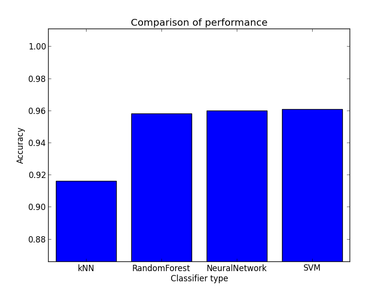

# Classifying Single-Cell Types from Mouse Brain RNA-Seq Data using Machine Learning Algorithms

-----

## Team mebers

- Samer Al-Saffar
- Hankyu Jang

## Datasets

- line 8: Header
- line 12 ~ line 5009: data with labels from 1 to 9
- data: column 1: cell name, column 2: label, column 3: activation level

### Prerequisite

Since the codes are written in Python 3, if you run the code on the campus servers, turn Python 3 module on by running:

```
module load python/3.6.0
```

The dataset is too large to push it into the Github. Please download the dataset [here](https://drive.google.com/open?id=0B44YNR0bSKpQQ1kwR0pOZEZFM2M), then make a directory data/ and save the expressionmRNAAnnotations.txt in the directory.

### Preprocessing

`data_cleaning.py`

- Input
    - expressionmRNAAnnotations.txt
    - kfold (integer)
- Procedure
    - Cleans the data, then creates data matrix X and corresponding label vector y
    - Prepares k sets of trainset and testset using cross-validation
    - Saves the datasets as npz file format

```
python src/data_cleaning.py -i data/expressionmRNAAnnotations.txt -o data/dataset -kfold 5
```

-----

## Experiment1 (Using original data)

### Source Codes

- `main_knn.py`
- `main_rf.py`
- `main_svm.py`
- `main_nn.py`
- `classification_algo.py`: Holds the classifications algorithms used in the experiment.

### Classifier 

I tried various sets of parameters for different classifiers. Results are saved here:

- knn.dat
- rf.dat
- svm.dat
- nn.dat

### Testing

- Parameter tuning for K nearest neighbor

    - number of neighbors: (3, 5, 7, ... , 19)
    - weights tuple: ("uniform", "distance")

```
python src/main_knn.py -i data/dataset.npz
```

- Parameter tuning for Random Forest

    - criterion tuple: ("gini", "entropy")
    - number of trees: 4, 8, 16, ... , 4096
    - minimum number of samples required to split an internal node: 2, 4, 8, ... , 32

```
python src/main_rf.py -i data/dataset.npz
```

- Parameter tuning for SVM

    - kernel: 'linear', 'poly', 'rbf', 'sigmoid'
    - penalty parameter C of the error term: 2^(-3), 2^(-1), ..., 2^(15)
    - gamma (Kernel coefficient for 'rbf', 'poly' and 'sigmoid'): 2^(-15), 2^(-13), ..., 2^(3)
    - degree of the polynomial kernel function: 1, 2, ... , 6

```
python src/main_svm.py -i data/dataset.npz -kernel linear
python src/main_svm.py -i data/dataset.npz -kernel poly
python src/main_svm.py -i data/dataset.npz -kernel rbf
python src/main_svm.py -i data/dataset.npz -kernel sigmoid
```

- Parameter tuning for Neural Network

    - hidden layers: 125 different hidden layers (2, 2, 2) to (32, 32, 32)125 different hidden layers (2, 2, 2) to (32, 32, 32)
    - activation function for the hidden layer: 
        - identity: f(x) = x
        - logistic: f(x) = 1 / (1 + exp(-x))
        - tanh: f(x) = tanh(x)
        - relu: f(x) = max(0, x)
    - solver for weight optimization:
        - 'lbfgs' is an optimizer in the family of quasi-Newton methods
        - 'sgd' ref    ers to stochastic gradient descent
        - 'adam' refers to a stochastic gradient-based optimizer proposed by Kingma, Diederik, and Ji    mmy
        - note: The default solver 'adam' works pretty well on relatively large datasets (with thousands of training samples or mo    re) in terms of both training time and validation score. For small datasets, however, 'lbfgs' can converge faster and perform b    etter. 
    - alpha(L2 penalty (regularization term) parameter): 2^(-14), 2^(-13), ... , 1

```
python src/main_nn.py -i data/dataset.npz -activation identity -solver lbfgs
python src/main_nn.py -i data/dataset.npz -activation identity -solver sgd
python src/main_nn.py -i data/dataset.npz -activation identity -solver adam
python src/main_nn.py -i data/dataset.npz -activation logistic -solver lbfgs
python src/main_nn.py -i data/dataset.npz -activation logistic -solver sgd
python src/main_nn.py -i data/dataset.npz -activation logistic -solver adam
python src/main_nn.py -i data/dataset.npz -activation tanh -solver lbfgs
python src/main_nn.py -i data/dataset.npz -activation tanh -solver sgd
python src/main_nn.py -i data/dataset.npz -activation tanh -solver adam
python src/main_nn.py -i data/dataset.npz -activation relu -solver lbfgs
python src/main_nn.py -i data/dataset.npz -activation relu -solver sgd
python src/main_nn.py -i data/dataset.npz -activation relu -solver adam
```

### Result

Best parameter sets found for each classifier

- knn: 
    - 0.701,n=7,weights=distance,kNN
    - 0.700,n=5,weights=uniform,kNN
- rf: 
    - 0.823,criterion=gini,n=1024,minss=2,RandomForest
    - 0.815,criterion=entropy,n=1024,minss=4,RandomForest
- svm: linear kernel produced accuracy: 0.859 regardless of C. polynomial kernel performs slightly better with fine tuning.
    - 0.862,kernel=poly,C=0.125,gamma=0.03125,degree=1,SVM
    - 0.862,kernel=poly,C=0.5,gamma=0.0078125,degree=1,SVM
    - 0.862,kernel=poly,C=2.0,gamma=0.001953125,degree=1,SVM
    - 0.862,kernel=poly,C=8.0,gamma=0.00048828125,degree=1,SVM
    - 0.862,kernel=poly,C=32.0,gamma=0.0001220703125,degree=1,SVM
    - 0.862,kernel=poly,C=128.0,gamma=3.0517578125e-05,degree=1,SVM
    - 0.859,kernel=linear,C=0.125,SVM 
- nn: activation=tanh worked the best among other activations. relu also works well.
    - 0.895,hls=(64, 64, 64),alpha=0.5,activation=tanh,solver=lbfgs,NeuralNetwork
    - 0.894,hls=(64, 64, 32),alpha=0.5,activation=tanh,solver=lbfgs,NeuralNetwork
    - 0.883,hls=(32, 64, 64),alpha=0.00048828125,activation=relu,solver=lbfgs,NeuralNetwork

I plotted the the best accuracy for each classifier.

```
python src/plot_best_four.py -i result/best_results.dat
```



-----

## Experiment2

The dataset used in Experiment1 has shape (4998, 3005). Compared to the samples, there seems to be too many features. Hence, in Experiment2, I implemented feature reduction algorithm PCA to reduce the dimension of the data.

### Source Codes

- `main_knn2.py`
- `main_rf2.py`
- `main_svm2.py`
- `main_nn2.py`

### Preprocessing

`data_cleaning_pca.py`

- Input
    - expressionmRNAAnnotations.txt
    - kfold (integer)
    - n (integer) for number of basis vectors to use
- Procedure
    - Cleans the data, then creates data matrix X and corresponding label vector y
    - Reduces the dimension of the dataset by applying PCA.
    - Prepares k sets of trainset and testset using cross-validation
    - Saves the datasets as npz file format

Example code for creating datasets by selecting top 100 basis vectors

```
python src/data_cleaning_pca.py -i data/expressionmRNAAnnotations.txt -o data/dataset_pca100 -kfold 5 -n 100
```

### Classifier 

I tried the good working parameters sets found in Experiment1 for each classifier. I changed each main function of the classifcation algorithm so that all the needed parameteres can be put in as parameters from terminal. For each algorithm, I used two different sets of good working parameters. I tried selecting different number of basis vectors using pca: 7, 13, 25, 50, 100, 200, 400, 500, 800, 1600.

Results are saved here:

- pca7.dat
- pca13.dat
- pca25.dat
- pca50.dat
- pca100.dat
- pca200.dat
- pca400.dat
- pca500.dat
- pca800.dat
- pca1600.dat

### Testing

Use the good parameter sets found above and feed them as parameter sets for each classification algorithms.

Example code using 100 basis vectors dataset

```
python src/main_svm2.py -i data/dataset_pca100.npz -C 0.125 -kernel linear
python src/main_svm2.py -i data/dataset_pca100.npz -C 0.125 -kernel poly -gamma 0.03125 -degree 1
python src/main_knn2.py -i data/dataset_pca100.npz -n 7 -weights uniform
python src/main_knn2.py -i data/dataset_pca100.npz -n 7 -weights distance
python src/main_nn2.py -i data/dataset_pca100.npz -hls 64 64 64 -activation tanh -solver lbfgs -alpha 0.5
python src/main_nn2.py -i data/dataset_pca100.npz -hls 32 64 64 -activation relu -solver lbfgs -alpha 0.00048828125
python src/main_rf2.py -i data/dataset_pca100.npz -criterion gini -n 1024 -minss 2
python src/main_rf2.py -i data/dataset_pca100.npz -criterion entropy -n 1024 -minss 4
```

Following bash scripts tests classification with different number of basis vectors.

```
./src/experiment2_7.sh
./src/experiment2_13.sh
./src/experiment2_25.sh
./src/experiment2_50.sh
./src/experiment2_100.sh
./src/experiment2_200.sh
./src/experiment2_400.sh
./src/experiment2_500.sh
./src/experiment2_800.sh
./src/experiment2_1600.sh
```

### Result

Output using 100 basis vectors dataset

- knn
    - 0.836,n=7,weights=uniform,kNN
    - 0.839,n=7,weights=distance,kNN
- svm:
    - 0.883,kernel=linear,C=0.125,SVM
    - 0.876,kernel=poly,C=0.125,gamma=0.03125,degree=1,SVM
- nn:
    - 0.871,hls=(64, 64, 64),alpha=0.5,activation=tanh,solver=lbfgs,NeuralNetwork
    - 0.881,hls=(32, 64, 64),alpha=0.00048828125,activation=relu,solver=lbfgs,NeuralNetwork
- rf:
    - 0.859,criterion=gini,n=1024,minss=2,RandomForest
    - 0.858,criterion=entropy,n=1024,minss=4,RandomForest

I drew the comparison plots by selecting the highest accuracy of each classifier. For example, I chose 0.839 as the accuracy of knn since 0.839 > 0.836. Following bash script draws all the plots required here.

```
./src/draw_plots.sh
```


## Conclusion

- Choosing appropriate number of basis vectors for dimension reduction is important
- If you decrease the dimension too much, the basis vectors would not represent the dataset
- Using around 50 to 100 basis vectors performed well on most of the classifiers
- Dimensionality reduction had different effect on each of the classifiers:
    - SVM
        - Accuracy(Original): 0.862
        - Accuracy(After Dimension Reduction with 100 basis vectors): 0.886
    - kNN
        - Accuracy(Original): 0.7
        - Accuracy(After Dimension Reduction with 50 basis vectors): 0.843
    - NN (performed decreased slightly)
        - Accuracy(Original): 0.895
        - Accuracy(After Dimension Reduction with 100 basis vectors): 0.884
    - RF
        - Accuracy(Original): 0.823
        - Accuracy(After Dimension Reduction with 50 basis vectors): 0.867

From the above result, choosing 50 ~ 100 basis vectors for dimension reduction seemed to be a resonable choice.

## For the future...

If choose number of basis in (50, 100) range, and with more different sets of parameters, there's chance to find a model that best describes the dataset. 
